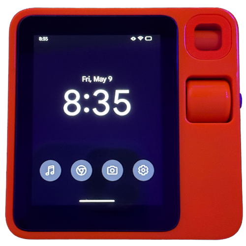
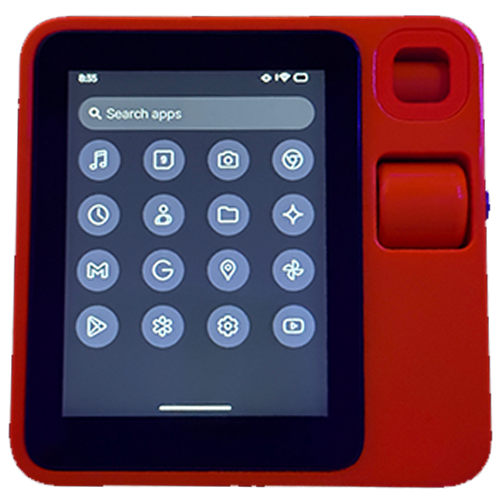
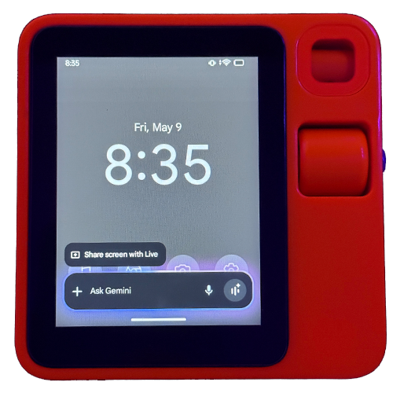

### DISCLAIMER

I am not responsible for what you do to your device, if you brick it or damage it all liability is on you , unlocking your bootloader voids the rabbit R1's warrenty so proceed at your own risk

---

## Screenshots

<div style="display: flex; gap: 10px; justify-content: center;">
  
  
  
</div>

---

## Prerequisites

- Unlocked bootloader via [R1 Escape](https://github.com/RabbitHoleEscapeR1/r1_escape) **or** Rabbit's official *Developer Mode*
- Android ROM for Rabbit R1 — [CipherOS (Android 15 based)](https://cipheros.org.in/devices/r1)
- ADB and Fastboot installed and working [Download from Google](https://developer.android.com/tools/releases/platform-tools)

---

## Flashing the ROM

1. Follow the instructions on the R1 Escape GitHub page to unlock the bootloader.
2. Once the bootloader is unlocked, boot into fastboot mode:
   ```bash
   adb reboot bootloader
   ```
3. Flash CipherOS or rom of choice :
   ```bash
   fastboot update cipheros.zip -w
   ```

---

## Initial Setup

1. After booting, set display density for proper scaling:
   ```bash
   adb shell wm density 190
   ```
2. Proceed with basic setup on the device.

---

## Debloating (Disable Stock Apps)
Use ADB to list apps you cant disable on device.
Example:
```bash
adb shell pm list packages
```
** DO NOT REMOVE CORE ANDROID APPS LIKE SYSTEM UI OR YOU WILL NEED TO REFLASH **


Use ADB to disable stock apps for a cleaner experience.  
Example:
```bash
adb shell pm disable-user --user 0 com.android.calendar
```
Repeat for other unnecessary apps.

---

## Apps I Installed

- Apple Music  
- Google Calendar  
- Chrome  
- Google Clock  
- Google Contacts  
- Files by Google  
- Gemini  
- Gmail  
- Google App  
- Google Maps  
- Google Photos  
- YouTube  

---

## Home UI Customization

Install the following:

- [Lawnchair 14](https://lawnchair.app/) 
- [Lawnicons](https://lawnchair.app/)  
- [Lawnicons](https://lawnchair.app/)   

### Lawnchair Setup:
- Icon size: **140%**
- Grid: **4x5**
- Fill dock with: `Apple Music`, `Chrome`, `Camera`, `Settings`
- Add the **default clock widget** to the home screen

---

## AI Assistant Emulation & Scroll Wheel Setup

1. **Install Button Mapper** [From the google play store](https://play.google.com/store/apps/details?id=flar2.homebutton&hl=en_GB)  
2. Bind **Volume Up** to "Scroll Up"
3. Bind **Volume Down** to "Scroll Down"

This allows the scroll wheel to work for page scrolling.

### Set AI Assistant Trigger:
- Go to `Settings > Apps > Default Apps > Assistant > Set assistant of choice (in my case Gemini)`
- Go to: `Settings > System > Gestures > Power Menu`
- Set **Hold Power Button** to launch **Gemini** (or assistant of your choice)

This emulates the Rabbit R1's AI button.

---

### How to power off
- as we dont have a stock Vol+ button to power off click the side button and scroll the scroll wheel up

---

### Rooting 
- Root access can be achieved with Magisk , [Download Magisk](https://github.com/topjohnwu/Magisk)
- Locate "boot.img" in your rom of choices zip
- Plug the R1 in to your computer, select the "charging this device" notification and select File Transfer
- copy boot img to device to a place like /downloads
- open magisk
- Select the "patch boot.img option" 
- select the boot.img you transfered and continue
- a new boot image with "magisk" in the name will be created, go back to the R1's internal storage on your pc and copy it on to the computer
- open terminal and cd to the directory you have the patched boot img in
- run this command :
```bash
fastboot flash boot_a "patched boot img name here" 
```
- reboot and open Magisk manager to finish install

---

### If something goes wrong
- if you hard brick you can flash back to stock using rabbits tool [here](https://rabbit-hmi-oss.github.io/flashing/)
- if you soft brick and can get in to recovery / fastboot you can reflash the OS using the commands above